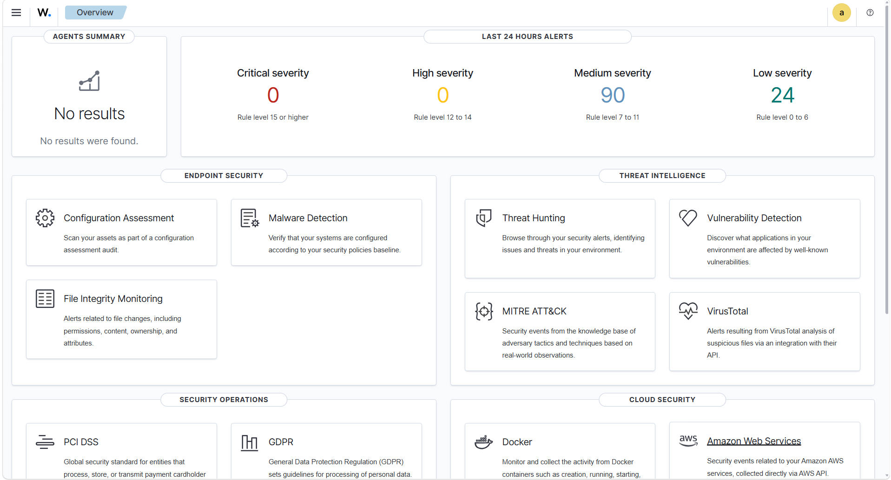
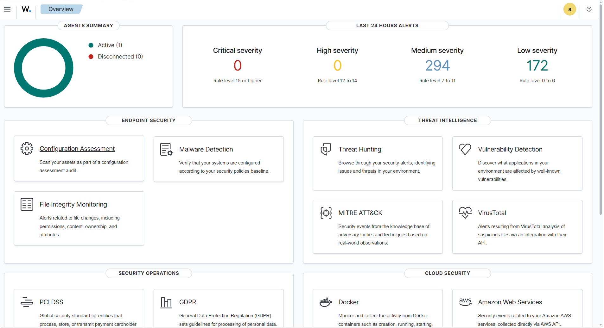
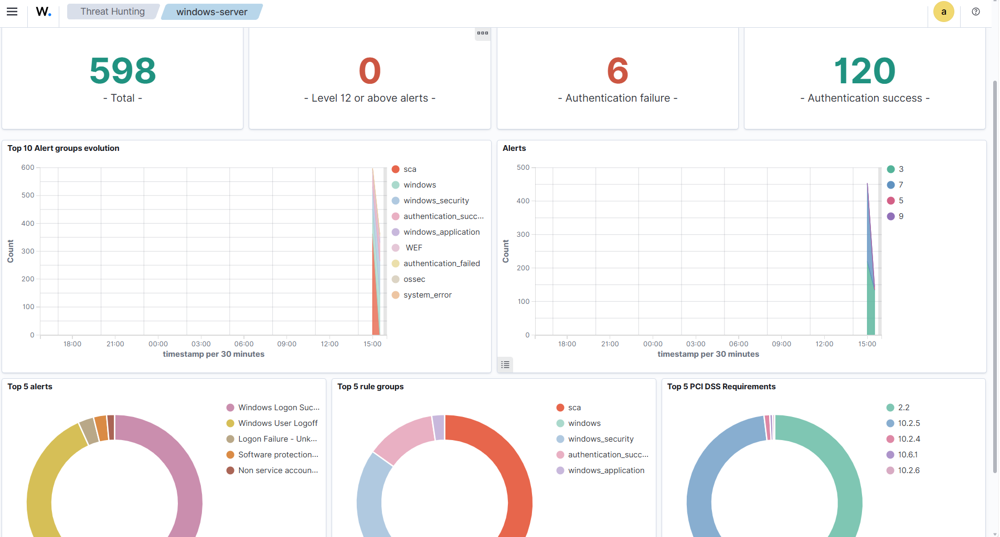
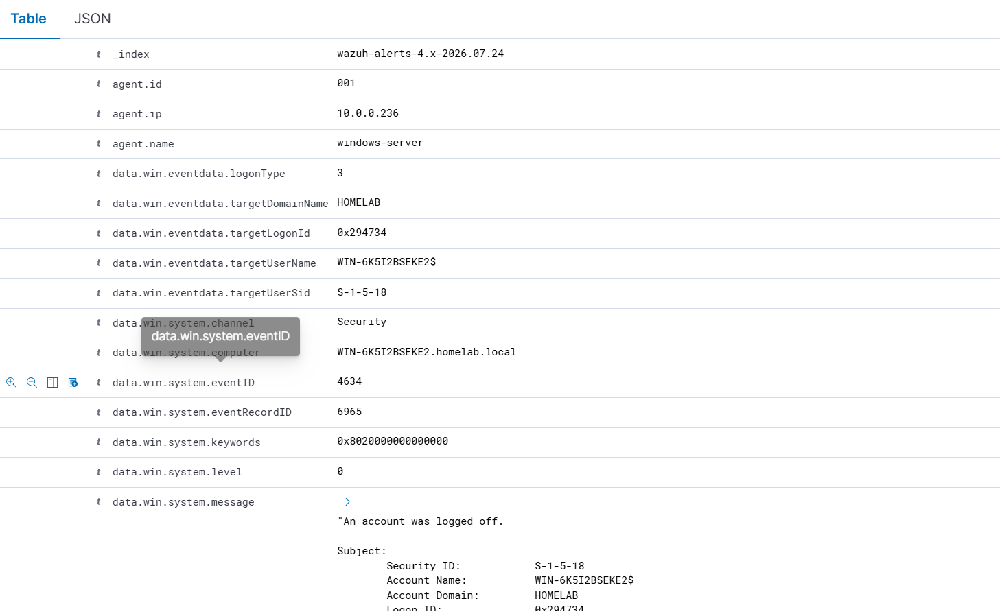
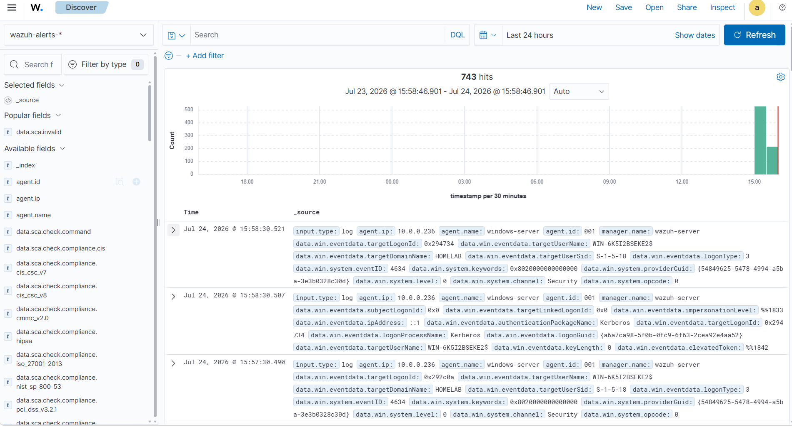
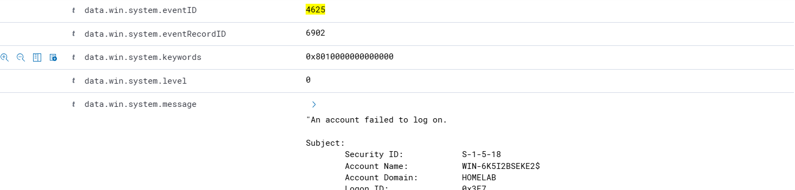
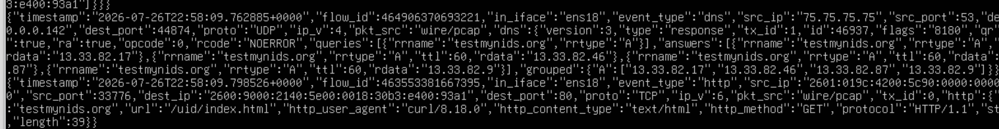
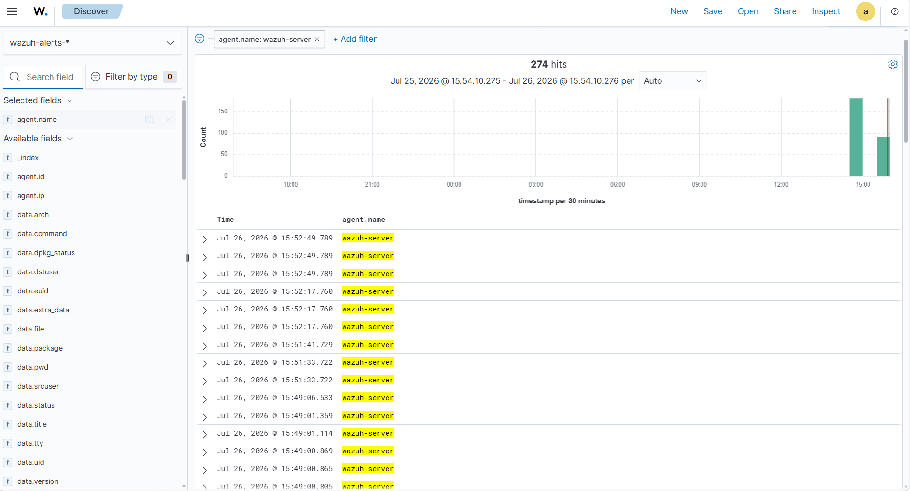

# Phase 3 — SIEM Deployment and Intrusion Detection

## Overview
Phase 3 covers deploying a Security Information and Event Management (SIEM) platform and integrating an Intrusion Detection System (IDS). This phase transforms the lab from a simple Active Directory environment into a monitored security operations setup capable of detecting, logging, and investigating real security events.

## Hardware Used
- Alienware Aurora R12 — Proxmox host running all VMs
- HP ZBook 16 G11 — management workstation and dashboard access
- TP-Link TL-SG108E managed switch

## Software Used
- Wazuh 4.9.2 (all-in-one deployment)
- Ubuntu Server 24.04 LTS
- Suricata 8.0.3 IDS
- Windows Server 2022 (Wazuh agent)

## Theory

### What is a SIEM?
A Security Information and Event Management system collects logs and events from across an environment, normalizes them into a searchable format, and generates alerts when suspicious activity is detected. In enterprise security operations, the SIEM is the primary tool analysts use to detect and investigate incidents. Wazuh is an open source SIEM that provides log analysis, file integrity monitoring, vulnerability detection, and compliance reporting all in one platform.

### What is an IDS?
An Intrusion Detection System monitors network traffic for suspicious patterns and known attack signatures. When a match is found, it generates an alert. Suricata is a high performance open source IDS that can analyze traffic in real time and output structured logs that other tools like Wazuh can ingest and display.

### What is a Wazuh Agent?
A Wazuh agent is a lightweight process installed on an endpoint that collects security events, system logs, and file integrity data, then forwards everything to the Wazuh manager for analysis. Agents allow the SIEM to monitor multiple machines from a single dashboard.

### What is EventID 4625?
Windows Security Event ID 4625 is logged every time an account fails to log on. It captures the target username, the source IP, the logon type, and the failure reason. In a real investigation, multiple 4625 events in a short window from the same source could indicate a brute force attack.

## Steps Completed

### 1. Deploying Ubuntu Server VM
- Created new VM in Proxmox (VM 101) with these specifications:
  - CPU: 2 cores
  - RAM: 8GB
  - Storage: 50GB
  - Network: vmbr0 (same bridge as Windows Server VM)
- Installed Ubuntu Server 24.04 LTS
- Configured static IP: 10.0.0.142
- Set hostname: wazuh-server

### 2. Installing Wazuh All-in-One
Wazuh was deployed using the official all-in-one installation script, which installs the Wazuh manager, indexer, dashboard, and Filebeat in a single automated process:

```bash
curl -sO https://packages.wazuh.com/4.9/wazuh-install.sh && sudo bash wazuh-install.sh -a -i
```

Installation took approximately 10 minutes. Upon completion, credentials were displayed in the terminal summary.

### 3. Accessing the Wazuh Dashboard
- Navigated to `https://10.0.0.142` from the HP ZBook browser
- Logged in with the admin credentials generated during installation
- Confirmed dashboard loaded with all modules visible

### 4. Deploying the Windows Server Agent
The Wazuh agent was installed on the Windows Server 2022 VM to begin collecting Windows Security Event logs.

Downloaded the MSI installer on the Windows Server using PowerShell:
```powershell
[Net.ServicePointManager]::SecurityProtocol = [Net.SecurityProtocolType]::Tls12
Invoke-WebRequest -Uri https://packages.wazuh.com/4.x/windows/wazuh-agent-4.9.2-1.msi -OutFile C:\wazuh-agent.msi
```

Installed the agent pointing to the Wazuh manager:
```powershell
msiexec.exe /i C:\wazuh-agent.msi /q WAZUH_MANAGER="10.0.0.142" WAZUH_AGENT_NAME="windows-server-2022"
```

Started the Wazuh service:
```powershell
NET START WazuhSvc
```

### 5. Verifying Agent Connection
- Navigated to Endpoints Summary in the Wazuh dashboard
- Confirmed windows-server agent showing as Active with IP 10.0.0.236
- Agent running Wazuh v4.9.2, registered to node01

### 6. Investigating Real Security Events
With the agent connected, the dashboard immediately began populating with Windows Security Event data. Using the Threat Hunting view filtered to the windows-server agent, the following was observed:

- 598 total events in the first session
- 6 authentication failures (EventID 4625) — intentionally triggered to test detection
- 120 authentication successes (EventID 4624)
- MITRE ATT&CK tactics detected including Defense Evasion, Privilege Escalation, and Initial Access

The Discover view was used to drill into individual events. A failed logon event showed:
- `data.win.system.eventID`: 4625
- `data.win.eventdata.targetUserName`: Administrator
- `data.win.eventdata.ipAddress`: 127.0.0.1
- `data.win.eventdata.logonType`: 2 (interactive logon)
- `data.win.system.channel`: Security

This confirmed the full detection pipeline was working — an action taken on the Windows Server was captured by the Wazuh agent and surfaced in the SIEM within seconds.

### 7. Installing Suricata IDS
Suricata was installed on the Wazuh server VM to monitor network traffic on the lab network:

```bash
sudo apt install suricata -y
sudo sed -i 's/interface: eth0/interface: ens18/' /etc/suricata/suricata.yaml
sudo systemctl enable suricata
sudo systemctl start suricata
sudo suricata-update
sudo systemctl restart suricata
```

### 8. Integrating Suricata with Wazuh
The Wazuh manager was configured to read Suricata's JSON event log by adding a localfile block to the ossec.conf file:

```xml
<localfile>
  <log_format>json</log_format>
  <location>/var/log/suricata/eve.json</location>
</localfile>
```

Confirmed Wazuh was reading the file:
```bash
sudo grep -i suricata /var/ossec/logs/ossec.log
```

Output confirmed: `wazuh-logcollector: INFO: (1950): Analyzing file: '/var/log/suricata/eve.json'`

### 9. Testing the IDS
Ran a test request to a known IDS test URL:

```bash
curl http://testmynids.org/uid/index.html
```

Suricata captured the full HTTP transaction including DNS resolution of testmynids.org, the TCP connection, and the HTTP GET request. Wazuh indexed 274 events from the Suricata log within the first session, confirming the full IDS to SIEM pipeline was operational.

## Troubleshooting
| Problem | Cause | Fix |
|---|---|---|
| 403 error downloading Wazuh MSI | TLS version mismatch on Windows Server | Forced TLS 1.2 with `[Net.ServicePointManager]::SecurityProtocol` before download |
| wazuh-manager service not found | Installing wazuh-agent on the all-in-one server overwrote manager components | Removed wazuh-agent, reinstalled wazuh-manager |
| API connection error in dashboard | Reinstall reset internal API credentials | Full clean reinstall using `-o` overwrite flag |
| ossec.conf XML parse error | Duplicate ossec_config tags from manual editing | Removed duplicate tags and validated with Python XML parser |
| Suricata events not appearing in Wazuh | Wazuh could not read eve.json due to permissions | Fixed with chmod 644 and chown wazuh:wazuh on the log file |

## Screenshots

### Wazuh Dashboard

*Wazuh 4.9.2 dashboard showing alerts across all modules*

### Windows Server Agent Connected

*windows-server agent showing active status at IP 10.0.0.236*

### MITRE ATT&CK and SCA Results

*Agent dashboard showing MITRE ATT&CK top tactics and CIS Windows Server 2022 Benchmark at 35% compliance*

### Threat Hunting — Authentication Failures Detected

*6 authentication failures and 120 successes detected from the windows-server agent*

### Discover View — Raw Event Log

*743 raw security events visible in the Discover view*

### EventID 4625 — Failed Logon

*Failed logon event showing Administrator account, 127.0.0.1 source, EventID 4625*

### Suricata Capturing testmynids.org Traffic

*Suricata eve.json showing DNS and HTTP traffic to testmynids.org captured in real time*

### Wazuh Discover — Suricata Events

*274 Suricata network events indexed in Wazuh Discover*

## Skills Demonstrated
- Linux server deployment and administration
- SIEM platform installation and configuration
- Wazuh manager, indexer, and dashboard setup
- Security agent deployment on Windows endpoints
- Windows Security Event log analysis
- EventID interpretation (4624, 4625, 4634)
- MITRE ATT&CK framework mapping in a live environment
- Intrusion Detection System installation and configuration
- Suricata rule management and updates
- SIEM and IDS integration via JSON log ingestion
- Real-time threat hunting and alert investigation
- Security Configuration Assessment interpretation
